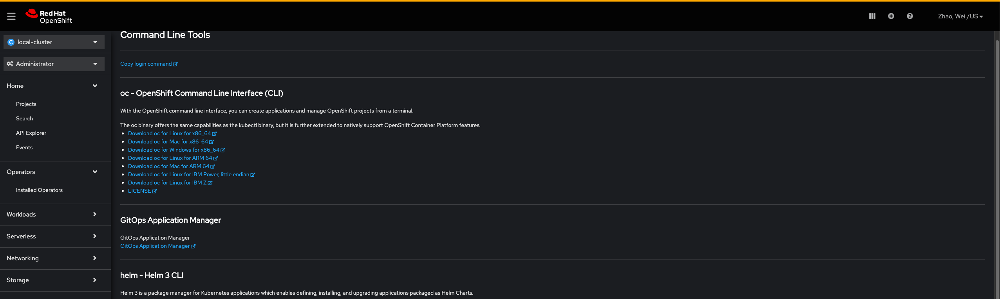

# Deploying a Docker Compose app on Openshift 4

Docker compose allows users to build and test multi-container Docker applications. That means developers can build container based applications without having to deploy to kubernetes or minikube for testing. Once a user is done developing and testing their application, they can then push to a production kubernetes cluster using Kompose. Kompose is a conversion tool that converts the resources used in the Docker Compose projects to artifacts that can be deployed on a Kubernetes cluster. This includes managed Kubernetes clusters such as Openshift.

Docker Compose Overview
Docker compose is a tool used to developer multi-container applications using just the docker engine installed on a user’s machine. Typically, After creating one or more Docker images, a user would have to deploy their application to a kubernetes cluster to test how the application would work in production. 

### Prerequisites
You need to have Docker Engine and Docker Compose on your machine. You can either:

Install Docker [Engine](https://docs.docker.com/engine/install/ubuntu/#set-up-the-repository) and Docker Compose as standalone binaries
Install Docker [Desktop](https://docs.docker.com/desktop/install/ubuntu/)   which includes both Docker Engine and Docker Compose

For Ubuntu and Debian, run:
~~~bash  
    sudo apt-get update
    sudo apt-get install docker-ce docker-ce-cli containerd.io docker-buildx-plugin docker-compose-plugin
    wget "https://desktop.docker.com/linux/main/amd64/docker-desktop-4.20.1-amd64.deb?utm_source=docker&utm_medium=webreferral&utm_campaign=docs-driven-download-linux-amd64&_gl=1*yx34ih*_ga*MTcyOTE3NTU0Ny4xNjg2NzY5ODcx*_ga_XJWPQMJYHQ*MTY4Njc2OTg3MC4xLjEuMTY4Njc3MTQ0Mi42MC4wLjA." -O docker-desktop-4.20.1-amd64.deb
    apt-get install docker-desktop-4.20.1-amd64.deb
    docker run hello-world  
    docker compose version
    docker --version
~~~

### Install OpenShift CLI   

1. login to openshit console
2. From the web console, click ?
3. Click Command Line Tools.
4. Select appropriate oc binary for your Linux platform, and then click Download oc for Linux. 

1-4 could be done the other way: (I storge one in s3://cloud-pipeline-aida-mihc-storage/RedHat/openshift/oc.tar)
5. tar xvf <file>

Place the oc binary in a directory that is on your PATH.
To check your PATH, execute the following command:

    echo $PATH

After you install the OpenShift CLI, it is available using the oc command:

    oc <command>

### Configure of oc

find credential here
  
oc login

### Run  
Clone the project  

~~~bash  
  git clone 
~~~

Go to the project directory  

~~~bash  
  cd my-project
~~~

Build and run your app with Compose

~~~bash  
    docker compose up
~~~

Start the server  

~~~bash  
npm run start
~~~  

## Authors  
- [@WeiZhao](https://github.com/weizhaosanofi)  
